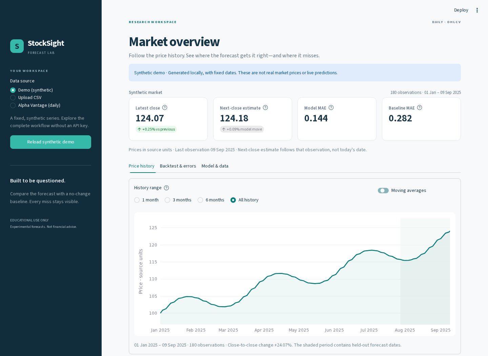

# StockSight



**An educational stock forecast lab that keeps its errors visible.**

StockSight is a Python dashboard for exploring daily prices, a simple Ridge
regression forecast, and an honest chronological backtest. A complete synthetic
demo loads immediately: no API key, account, or network connection is needed.

## Start locally

Use Python **3.11 or newer**. From the project folder:

```bash
python -m venv .venv
```

Activate the environment on macOS/Linux:

```bash
source .venv/bin/activate
```

Or in Windows Command Prompt:

```bat
.venv\Scripts\activate
```

Then install and run:

```bash
python -m pip install -r requirements.txt
python -m streamlit run app.py
```

Open `http://127.0.0.1:8501`. The included configuration binds the development
server to localhost. Hosting requires an explicit address override appropriate
to that environment, for example `--server.address=0.0.0.0`.

The stack is Streamlit, pandas, NumPy, scikit-learn, Plotly, and requests. There
is no JavaScript build, database, Docker requirement, or separate API server.
Streamlit 1.64+ is required for the dashboard's sizing APIs.

## Try the complete workflow

1. The **Demo (synthetic)** dashboard is ready on first load. Its 180 generated
   observations have fixed dates in 2025; they are not market data.
2. In **Price history**, change the range and toggle moving averages. The
   chart filter does not change the data used for model fitting.
3. Open **Backtest & errors**. Compare model MAE with the baseline that predicts no change,
   inspect the aligned prediction lines, and read individual errors.
4. Choose the number of displayed ledger rows or download the full backtest
   CSV. Results remain available through these interactions.
5. Open **Model & data** to see inputs, the training process, and limitations.

Analysis results live in Streamlit session state. Switching the selected source
does not silently replace them or send a provider request. A visible message
identifies the currently displayed dataset until a new analysis succeeds.
Invalid uploads and provider failures preserve the previous result. A new
browser session starts with the demo again.

## Bring your own CSV

Choose **Upload CSV**. Download the example CSV for a complete, valid synthetic
file, or supply your own CSV file encoded as UTF-8 with these columns:

```csv
Date,Open,High,Low,Close,Volume
2025-01-02,100,102,99,101,1200000
2025-01-03,101,103,100,102,1150000
```

That snippet shows the format; analysis needs **at least 60 daily observations**.

| Rule | Behavior |
| --- | --- |
| Size | Up to 5 MB and 10,000 rows |
| Headers | Case and surrounding whitespace are normalized; duplicates are rejected before parsing |
| Dates | Use `YYYY-MM-DD`; input is sorted, with one observation per date |
| OHLC prices | Finite, numeric, positive, with low ≤ open/close ≤ high |
| Volume | Finite and nonnegative; zero is valid |
| Missing or invalid cells | Rejected with an actionable message; never silently dropped |
| Extra columns | Ignored after validating column names |
| Gaps | Preserved; observations are not inserted or filled from earlier values |
| Units | Source price units are used; the app does not assume USD |

The CSV's author is responsible for currency, adjustment status, and provenance.
Upload one daily instrument at a time. Intraday files and files containing multiple
symbols are not supported. When a window contains no volume, its relative volume feature is zero.

## Optional provider data

Select **Alpha Vantage (daily)**, enter a ticker and your own API key, and choose
**Load daily data**. The app requests compact daily OHLCV history through
`TIME_SERIES_DAILY`. You can also set `ALPHA_VANTAGE_API_KEY` in the environment
before launching the app.

The key is sent to Alpha Vantage and held in the current session; it is not
written to project files. Request URLs, raw provider messages, and exception
details are never displayed because they may contain credentials. Requests have
a timeout of 20 seconds. Data availability and rate limits depend on the provider
and the key's plan. Daily observations are not streaming quotes. The dashboard
shows the last observation date, snapshot preparation time, and a warning for
provider history more than a week old.

The demo and CSV paths work offline after installation. Tests use controlled
provider responses and require no real credentials.

## How the model works

1. **Features:** current close, returns over 1 and 5 observations, moving averages
   over 5 and 20 observations, return volatility over 20 observations, and
   volume relative to its average over 20 observations. The first 20 rows warm up the
   indicators. Every feature uses only its current observation and earlier ones.
2. **Target:** the next supplied observation's close. Both the input date and
   target date are retained. Charts and exports use the **target date**, avoiding
   a subtle shift of one observation.
3. **Evaluation:** the oldest 80% of labeled rows fit `StandardScaler` and
   `Ridge(alpha=1.0)`. That model remains fixed while predicting the newest 20%.
   Neither scaling nor fitting sees the target prices in the test set. This is a single
   chronological holdout, not repeated validation or a rolling retraining study.
4. **Baseline:** predict that the next close equals the current close. MAE, RMSE,
   and direction accuracy use the same test period. Ties count as a separate
   unchanged direction. A failure to beat the baseline is stated plainly.
5. **Next close estimate:** after evaluation, refit on all known targets and
   predict from the newest feature row. Its target is still unknown. This refit
   never replaces the stored backtest predictions or metrics.

MAE is average absolute error in the source's price units; RMSE gives larger
misses more weight. Direction hit rate is not a trading return. Positive signed
error in the ledger means the forecast was too high.

## Project structure

| File | Responsibility |
| --- | --- |
| `forecast.py` | Data validation, CSV/provider loading, feature generation, model evaluation, reusable result dictionaries |
| `app.py` | Input forms, session snapshots, charts, metrics, source labels, and CSV downloads |
| `styles.css` | Responsive dashboard styling |
| `.streamlit/config.toml` | Theme, local binding, upload limit, and telemetry setting |
| `test_forecast.py` | Validation, chronology, alignment of target dates and exports, and safe provider errors |
| `test_app.py` | Real Streamlit AppTest coverage for default demo, reruns, source changes, and error recovery |
| `docs/development-plan.md` | Scope, design decisions, and verification plan |

The data functions return ordinary DataFrames, tuples, or dictionaries. There
is no hidden model service or framework beyond the existing libraries.

## Verify changes

```bash
python -m unittest discover -v
python -m compileall -q app.py forecast.py test_app.py test_forecast.py
```

GitHub Actions runs the unittest suite. The suite covers finite/OHLCV checks,
short histories, duplicate dates and raw CSV headers, zero volume, safe error
messages, target date alignment, complete backtest exports, and session persistence.
The chronology regression changes only later observations and verifies that
earlier test predictions do not change.

Streamlit AppTest may print its harmless `missing ScriptRunContext` warning
when started outside a running Streamlit server.

## Limitations

- Synthetic data is unusually smooth. Strong demo metrics are not evidence that
  real stock prices can be predicted reliably.
- Provider data is unadjusted. Splits, dividends, missing sessions, news, and
  regime changes can distort this simple model. Uploaded adjustments are not
  verified.
- The model has no uncertainty interval, trading rules, transaction costs,
  external financial information, or independent future validation.
- Windows count supplied observations. No exchange calendar is assumed, so the
  next forecast has no invented calendar date. If the last input is old, the
  estimate follows that old observation rather than today's market.
- A linear model can extrapolate implausible values. Forecasts are experimental,
  educational output and are not financial advice or trade recommendations.

## Why I built this

I wanted to understand how programming and machine learning could help study
historical stock data beyond looking at a price chart. This project makes the
pipeline visible from inputs to predictions to errors while keeping the code
small enough to learn from.
